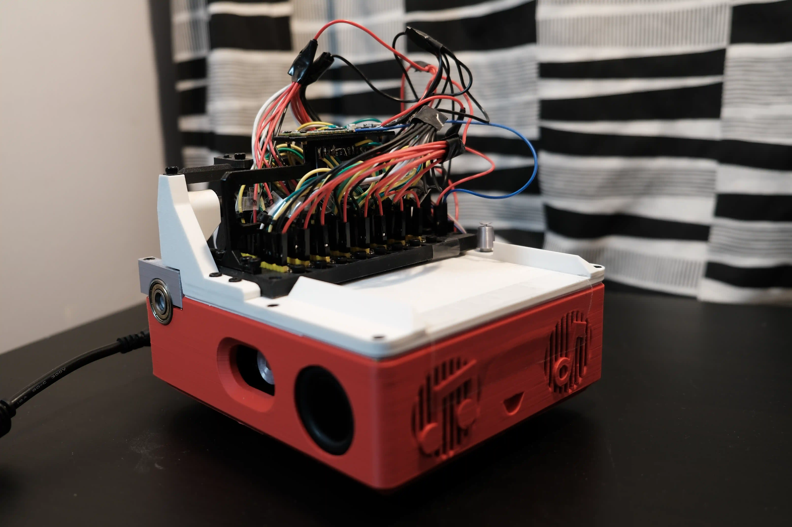
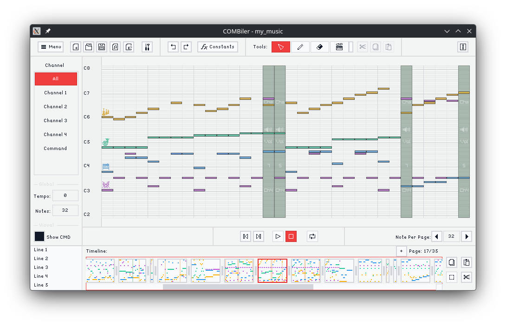
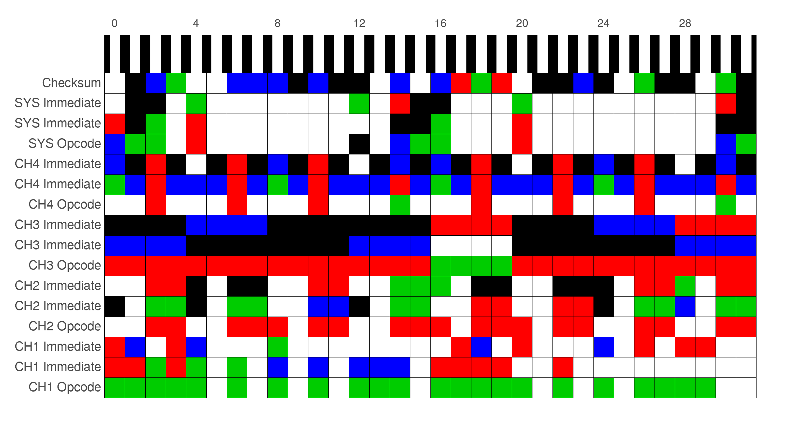
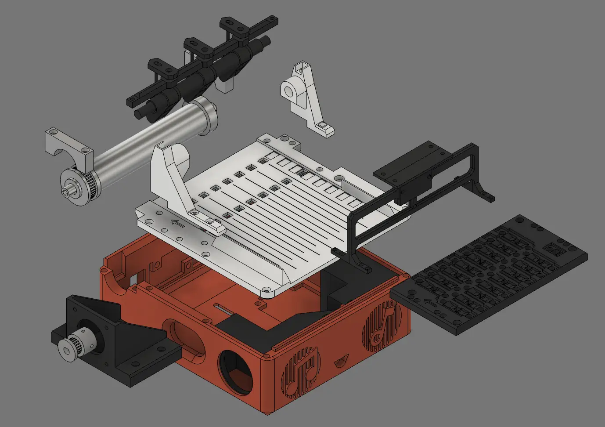
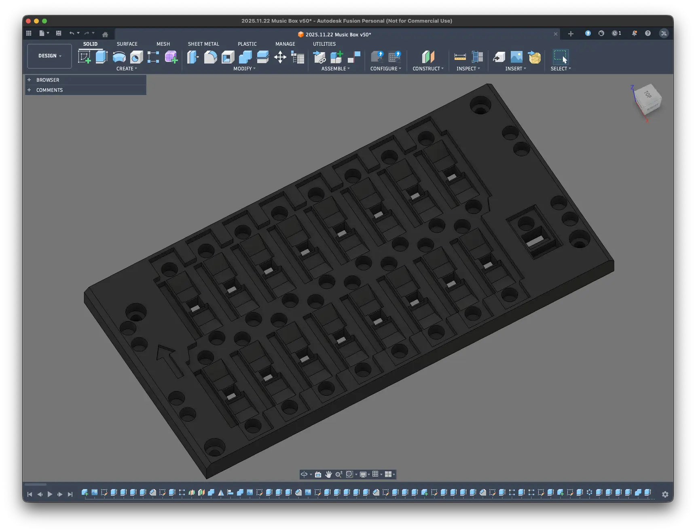
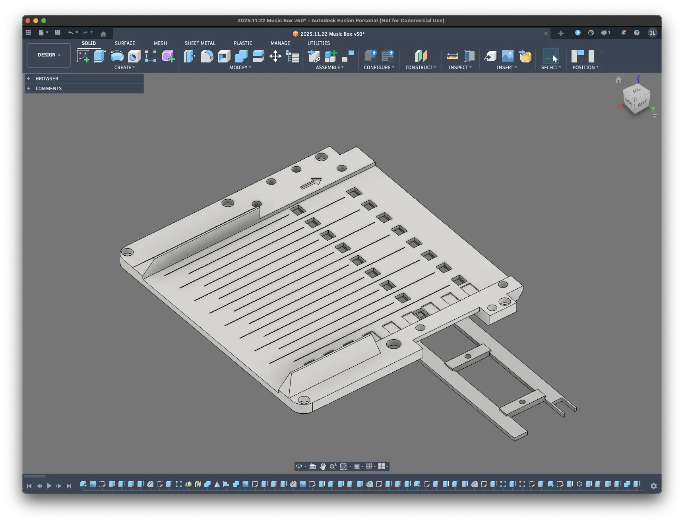
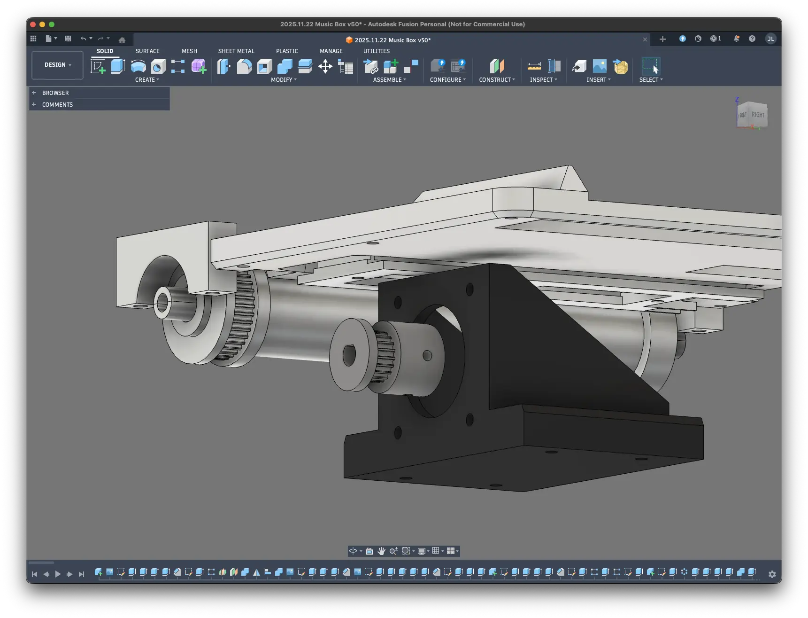

# COMB Optical Music Box

A music box that reads color encoded paper strips and plays music.

[Watch the Demo](https://youtu.be/zGZGxKDOgjg)

## About The Project

It's a silly project that try to encode music in a colored paper strip.

Originally, I was just trying to create software similar to [Lovely Composer](https://doc1oo.github.io/LovelyComposerDocs/en/) that I discovered last summer. I really enjoyed playing with it and created a lot of music. So I was like, why don't I try to recreate a program similar to that, you know, just for fun and also to learn how these kinds of programs are actually made! But I never actually made it.

Then, I made a very simple music box (pretty much just an mp3 player) using Arduino and DF Player, and I was like, what if I try to create Lovely Composer but in hardware instead!

The original idea was to use stamps with unique symbols/shapes to represent instruments and colors to represent different octaves, something along those lines (I had so many different ideas). And use machine learning to do image recognition. But after some trials, I gave up pretty quickly. I tried a few different cameras, but they all seemed to have things like auto white balance, autofocus, etc., all kinds of "good stuff" built in, which I had no idea how to disable, or if that was even possible. And they really messed up the classification. I guess if you have more experience, you might know how to counter that with some algorithms and stuff? But I don't really have that experience, so I tried to simplify the design instead.

What if instead of recognizing shapes, I just recognize color? So, like a punch hole music box, but instead of just hole or no hole, it would be cool if each color could represent a different instrument. But then, I would have very limited pitches, so I was like, what if I make the black color encode binary commands, and it can change the state of the machine, etc. Anyway, as time went on, I came up with more and more ideas, and ultimately decided that I would design a full fledged encoding system.

The original system used base 6 instead of base 5, since 6^3 = 88 + 128, which means with just 3 digits, I can represent all 88 keys on a keyboard and 128 instruments in a general midi sound bank (well, minus the drum sets). But later I decided to use base 5. One reason was to reduce the probability of misclassification, the second was just that I like the idea of using only red, green, blue, black, and white. With base 5, I lose some density, but I think sometimes working with constraints is fun as well.

Another thing I ditched was the chord system. I was hoping to recreate a chord system similar to Lovely Composer, where by just placing one note, it pretty much handles the chord for you. That way, even though that would sacrifice an instrument channel, in return, I could have very rich and thick layers without much work. But in the end, I felt like that would abstract away too much of how the machine works. I want transparency for the users so none of the actions are performed implicitly. ~~And not to mention that saved like tons of work.~~

Of course, that also means the complexity has gradually increased. Many ideas were added and dropped, and now it requires a separate [encoder](https://github.com/js-lm/COMBiler), a "compiler" you may say, to actually write the music (or you can try to compose the music line by line, that would be cool as well!), which was inspired by, you guessed it, Lovely Composer. It's pretty much just a cheap knockoff version of it.

## The Encoding System

To read the full document, you can go check [here](documents/base_5_optical_music_encoding_system.md).

Pretty much, the 16 lanes are divided into 5 groups, each with 3 digits: 4 instrument groups and 1 system group (plus a 1 digit checksum).

Each group has an opcode that tells the system which instruction to execute. For instruments, it's whether to play a note or change the instrument; for the system, it's whether to change the tempo, the volume of chosen channel(s), or the articulation of chosen channel(s).

With just these 3 system commands, in theory, you can play almost all kinds of music genres out there (don't quote me, I haven't studied music theory for almost a decade). Although you can (mostly) only play 4 notes at the same time. (I did put a latch state there, which in theory can give you up to the maximum simultaneous notes the sound engine allows, but I still haven't figured out how to properly use it in a music.)

## Future Plans

I don't know if I will continue working on the project. But if I do, I do have a few things that I want to work on.

- I want to create my own sound engine. I am using M5Stack Unit MIDI to produce the sound right now, but I really want to have my own sounds. But since that alone would probably take just as long, if not longer, than this project took me, I feel like that should be a separate project.
- Currently, I am using a stepper motor (because originally it was supposed to be open loop). But with the optical markers, I think a DC motor would be a much better choice. It frees up a core and should be much faster than a stepper motor (although motor speed is just one limiting factor).
- Case, the current 3d model, to put it bluntly, sucks. I didn't really put much thought into it when designing it. If I were to redesign it, I want the machine to resemble a printer. I will probably also ditch the speakers. They take up too much space, and the sound quality is just not good given their size. (Also, one of the vital flaws I missed during the design phase was that there is no way to get the paper out in the middle of playback. If the paper gets stuck, which luckily has never happened, I would have to disassemble the machine to take the paper out.)
- Like the case, I want to design a PCB for it. But the current design is much more complicated than any baby PCB design I have done before. But even just a carrier board would be good enough. Not having to solder like 3 millions loose wires and trace which wire is which alone would be a huge step up.

|  |  |  |
|:-:|:-:|:-:|
|  |  |  |

## LICENSE
    COMB Optical Music Box
    An optical music box that reads color encoded paper strips and plays music.
    Copyright (C) 2026  Joshua Lam <me[at]joshlam.dev>

    This program is free software: you can redistribute it and/or modify
    it under the terms of the GNU General Public License as published by
    the Free Software Foundation, either version 3 of the License, or
    (at your option) any later version.

    This program is distributed in the hope that it will be useful,
    but WITHOUT ANY WARRANTY; without even the implied warranty of
    MERCHANTABILITY or FITNESS FOR A PARTICULAR PURPOSE.  See the
    GNU General Public License for more details.

    You should have received a copy of the GNU General Public License
    along with this program.  If not, see <https://www.gnu.org/licenses/>.